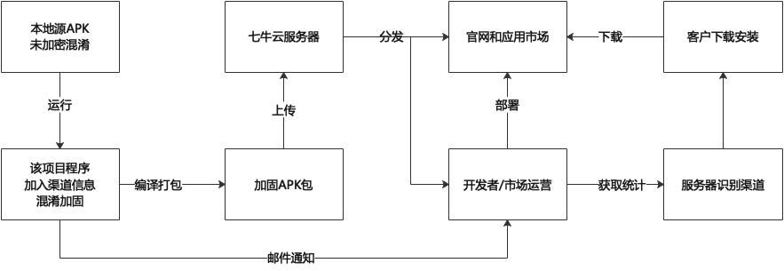

# ChannelAPKObfuscator

# 项目介绍
渠道包自动拆包混淆项目，为APK文件加注渠道信息并混淆加固代码。

flutter channel package automatic unpacking obfuscation project, add channel information to APK files and obfuscate the hardened code

专门为Flutter项目设计，在每次打出APK包时，往往用AndroidStudio项目会定义多个渠道包，但通过IDE打包对每个APK逐一进行加固会比较麻烦，Flutter在底层调用时，会调用MethodChannel识别的方案。

为了解决这个问题，我们在打包时将渠道信息嵌入assets位置下，并在App启动时就可以读取调用渠道，并且拆包验签自动完成，再使用360加固混淆命令行，进行加固服务。

Specifically designed for Flutter project, in each time to type out the APK package, often with AndroidStudio project will define multiple channel packages, but through the IDE packaging to each APK one by one reinforcement will be more trouble, Flutter in the bottom call, will call MethodChannel identification of the program.

In order to solve this problem, we embed channel information under assets location during packaging, and can read the call channel when the App is launched, and unpacking check sign is done automatically, and then use 360 reinforcement obfuscation command line for reinforcement service.

